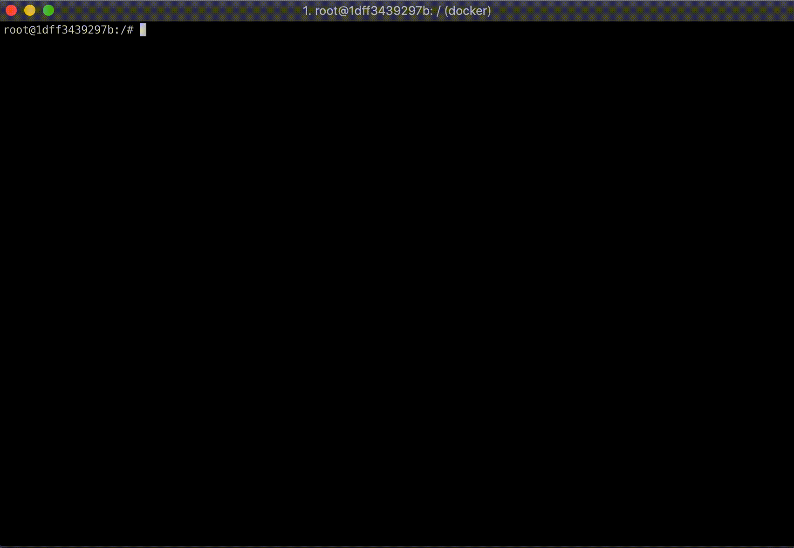
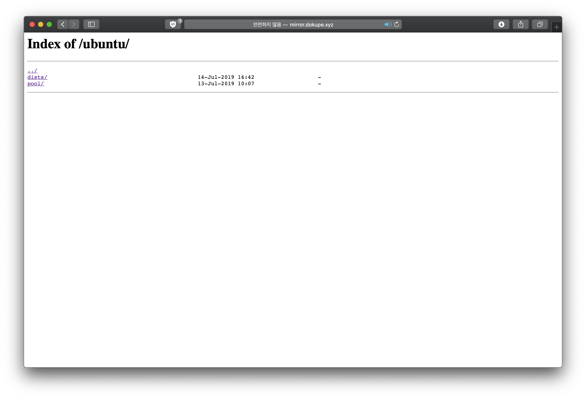

# Docker로 쉽게 올리는 나만의 APT 미러 서버

안녕 독자들. 문득 그런 생각이 들었다. 흔히 `apt-get` 명령어를 통해 필요한 패키지를 쉽게 다운로드 받고, 그게 익숙한 것이 되다 보니 마치 수도꼭지에서 물 틀어 마시듯 당연하게 사용하고 있는데, 만약 무슨 일이 생겨 APT 패키지를 제공하는 서버가 내려간다면? 

사실 그래서 존재하는 것이 미러 (Mirror) 서버다. 원본 서버가 제공하는 정보들을 복제해 다른 경로를 통해 다시 제공하는 것. 꼭 APT가 아니더라도 음악 미러, 동영상 미러 사이트 등의 이름으로 일반인에게도 나름 친숙한 개념이 되었다. 

이미 국내외 다양한 개인, 단체가 제공하는 APT 미러 서버가 있어 한두곳이 내려간다고 해도 사실 행복한 리눅스 라이프에는 큰 지장이 없지만, 그 미러 서버, 우리도 돌려볼 수 있지 않을까?

직접 미러를 운영한다면 나에게는 언제나 믿고 접근할 수 있는 든든한 APT 백업이 생기는 것이고, 다른 유저들에게는 APT를 사용할 때 선택 폭이 넓어지는 선순환이 될 수 있다. 꼭 퍼블릭하게 공유하지 않더라도, 예를 들어 사내 폐쇄 망에 붙어 돌아가는 서버가 APT를 통한 패키지 설치, 업데이트가 필요할 경우 자체 미러 서버를 운영해 폐쇄 망과 연동시키는 등 활용도는 무궁무진하다. 극단적으로 생각하면 재난 상황 등 인터넷 망이 날아간 상황에서도 리눅스 서버를 세팅하겠다는 뼈브옵스, 뼈발자 분들에게도 도움이 될 수 있겠고. 

깊게 생각하지 않아도, 커뮤니티의 일원이 된다는 것은 언제나 매력적인 일이다. 그 커뮤니티의 일부로서 스스로가 기여한 무언가가 훗날 많은 사람들에게 도움이 된다면 더할 나위 없지 않을까.

## 내 컴퓨터에서 APT는 어떻게 동작할까?

백문이 불여일견이라고, 아리송한 것도 일단 해보면 감이 잡히겠지만, 그 '아리송' 한 상태부터 되기 위해서는 약간의 이론 지식이 필요하다.

지금 데비안 계열 OS를 사용하고 있다면, `/etc/apt/sources.list` 파일을 열어 보자. 아래와 같은 내용이 담겨 있을 것이다.

    # See http://help.ubuntu.com/community/UpgradeNotes for how to upgrade to
    # newer versions of the distribution.
    deb http://archive.ubuntu.com/ubuntu/ bionic main restricted
    # deb-src http://archive.ubuntu.com/ubuntu/ bionic main restricted
    
    ## Major bug fix updates produced after the final release of the
    ## distribution.
    deb http://archive.ubuntu.com/ubuntu/ bionic-updates main restricted
    # deb-src http://archive.ubuntu.com/ubuntu/ bionic-updates main restricted
    
    (...)

빼곡하게 적혀있는 URL의 앞에 적혀있는 `deb` 는, `.deb` 확장자로 만들어진 데비안 애플리케이션 패키지를 뜻한다. `deb-src` 는 패키징이 이루어지지 않은 애플리케이션 소스, 그리고 추후의 패키징을 위해 패키지명 정보 등을 담은 `dsc` (데비안 컨트롤 파일) 이 되시겠다. 즉, 위 예시 파일은 저장소에서 이미 패키징이 된 `deb` 파일만 다운로드 받겠다라는 뜻이 된다.

저장소 URL - `[http://archive.ubuntu.com/ubuntu/](http://archive.ubuntu.com/ubuntu/)` 은 우분투에서 자체적으로 제공하는 1차 아카이브 (우분투 직속) 저장소에 연결하는 링크다. 일반적으로 사용되는 것은 `http` 지만, APT는 `ftp` 등 파일 전송이 가능한 다양한 프로토콜을 함께 지원한다.

그 뒤에 따라오는 `bionic` 은 우분투의 버전 코드네임 (18.04 LTS), `main`, `restricted`, `universe`, `multiverse` 는 저장소에 올라와 있는 애플리케이션이 무료인지, 코드가 완전히 공개되어 있는지, 유료 라이센스가 필요한지 등에 따라 정리해둔 일종의 카테고리라 생각할 수 있겠다. 관련하여 자세히 알고 싶다면 [이 링크](https://www.howtogeek.com/194247/whats-the-difference-between-main-restricted-universe-and-multiverse-on-ubuntu/)를 참조하자.

우리가 APT를 사용하기 위해 `apt-get update` 명령어를 사용하게 되면, APT는 방금 위에서 살펴본 `/etc/apt/sources.list` 파일을 기반으로 저장소를 읽어 다운로드 받을 수 있는 프로그램들의 리스트를 만들게 된다. 해당 리스트는 `/var/lib/apt/lists` 에서 확인할 수 있다.

리스트를 갱신한 후 `apt-get install` 명령어를 사용하면 해당 리스트에서 내가 원하는 애플리케이션이 존재하는지 확인한 후, `sources.list` 에 명시된 원격 저장소에서 패키지를 다운로드해 와 로컬 머신에 설치하게 된다.

그리고 예상했겠지만, 우리의 APT 미러 서버가 완성될 경우 이 `sources.list` 에 적혀있는 원격 저장소 URL을 우리 것으로 바꿔줄 것이다. 

대충 내 컴퓨터에 설치된 APT가 무엇을 담고 있는지 살펴봤으니, 본격적으로 미러를 구성해보자. 

## 미러 서버 올리기

### 구조부터 살펴볼까?

APT 미러는 기본적으로 `deb` 와 `deb-src` 가 잔뜩 담겨있는 보따리에 불과하기에, 이론적으로는 온라인에서 파일을 끌어올 수 있는 어떤 도구를 사용하더라도 구축할 수 있지만, 최근에는 `[apt-mirror](https://apt-mirror.github.io/)` 라는 도구가 마치 표준처럼 널리 사용되고 있다. 언제나 미리 ~~갈려나간~~고생해준 개발자에게 묵념.

널리 사용되는 도구인 만큼 APT 리스트에도 올라가 있어 당장 우분투 등의 OS에서 `apt-get install apt-mirror` 명령어를 통해 설치할 수도 있지만, 조금 더 편리하고 깔끔한 구성을 위해 필자가 도커화시켜 명령어 한 줄이면 모든 것을 실행할 수 있게 이미 다 준비해 두었다. [kycfeel/dockerized-apt-mirror](https://github.com/kycfeel/dockerized-apt-mirror) 에서 전체 구조를 살펴볼 수 있다. 

Git 저장소를 다운로드 받은 후, `mirror.list` 파일을 먼저 살펴보자. 마치 조금 전 확인했던 `/etc/apt/sources.list` 파일처럼, 원격 APT 저장소에 대한 링크와 카테고리 등이 명시되어 있다.

APT 서버를 직접 구동한다고 해도, 결국 그 안에 들어갈 패키지들은 이미 구비되어 있는 어딘가에서 끌어와야 한다. `apt-mirror` 는 바로 이 파일에 명시된 원격 저장소에서 각 OS 혹은 버전별 패키지들을 다운로드 (미러링) 한다. 글 작성 시점 (2019년 7월 16일) 기준으로, Git에 올려둔 `mirror.list` 에는 [우분투 공식 저장소](//archive.ubuntu.com/ubuntu) 에서 16.04 LTS, 18.04 LTS, 19.04 LTS, 그리고 19.10의 패키지들을 미러링 하도록 명시해 두었다. 물론 필요에 따라 얼마든지 다른 저장소나 버전을 추가할 수 있겠다.

파일에 문제가 없다면, 이제 `crontab/apt-mirror` 을 열어보자. 이곳에는 어느 주기로 원격 저장소에서 파일을 다시 받아올 지 명시하는 crontab 규칙이 담겨 있다. 중요한 부분은 파일 맨 앞에 있는 cron 주기 표시다. 기본은 `0 4 * * *`, 매일 오전 4시에 (UTC) `apt-mirror` 명령어를 다시 실행하도록 설정해 두었다. 본인의 필요에 따라 수정을 권장하고, cron 규칙이 영 무섭게 생겼다면 [crontab.guru](http://crontab.guru) 사이트가 도움의 손길을 내밀어줄 것이다.

마지막으로 `[postmirror.sh](http://postmirror.sh)` 다. `apt-mirror` 는 매번 원격 저장소에서 파일을 다운로드 한 후 이 스크립트를 실행해 마무리 작업을 한다. 의무적으로 무언가 요구되는 작업은 없어 이 파일을 공백으로 내비 둬도 상관 없지만, Git 저장소에 올린 파일에는 이 곳에 `apt-mirror` 의 내부 `/var/spool/apt-mirror/var/clean.sh` 스크립트를 명시해 둬 다운로드 후 더 이상 필요 없는 찌꺼기를 알아서 지울 수 있게 해뒀다.

`docker-compose.yaml` 을 열어보면 방금 확인했던 파일들을 볼륨의 형태로 마운트해 `apt-mirror` 컨테이너 사용한다는 것을 알 수 있다.

    volumes:
          - ./apt-mirror-volume:/var/spool/apt-mirror
          - ./postmirror.sh:/var/spool/apt-mirror/var/postmirror.sh
          - ./mirror.list:/etc/apt/mirror.list
          - ./crontab:/etc/cron.d

추가적으로, `volumes` 단락의 맨 위, `apt-mirror-volume` 은 `apt-mirror` 도커 컨테이너가 다운로드 받은 APT 미러 데이터를 저장하는 경로다. Git 폴더에 있는 그 `apt-mirror-volume` 맞다. 만약 Git 문제 (변경사항을 초기화 한다던지)로 다운로드 받은 APT 데이터의 손상이 걱정된다면 Git 폴더 외부에 따로 저장용 경로를 만든 후 `apt-mirror-volume` 으로 심볼릭 링크를 걸어주는 것을 추천한다. 아니면 `docker-compose` 파일 자체를 편집해도 되고. Up to you.

### 진짜로 실행하기

구조를 하나하나 찬찬히 모두 살펴봤으니, 이제 정말 서버를 실행할 때가 왔다. 아래 명령어 한 줄 이면 충분하다. 괜히 도커가 있는게 아니다.

    docker-compose up -d

컨테이너가 올라갔다면, `docker logs <apt-mirror-컨테이너-이름>` 으로 정상적으로 `apt-mirror` 가 실행되고 있는지 확인하자. 처음 실행이라면, 약 **500GB ~ 600GB** 정도의 파일이 다운로드 될 것이다. 다운로드에는 수 시간이 소요될 수 있다. 만약 용량이 너무 부담스럽다면, 상단의 `mirror.list` 를 수정해 필요없는 저장소를 제외하도록 하자.

    (...)
    
    Running the Post Mirror script ...
    stdout
    03:27:49
    (/var/spool/apt-mirror/var/postmirror.sh)
    stdout
    03:27:49
    stdout
    03:27:53
    Removing 309 unnecessary files [239.2 MiB]...
    stdout
    03:27:56
    [0%]...............................done.
    stdout
    03:27:56
    stdout
    03:27:56
    Removing 0 unnecessary directories...
    stdout
    03:27:56
    done.
    stdout
    03:27:56
    stdout
    03:27:56
    stdout
    03:27:56
    Post Mirror script has completed. See above output for any possible errors.
    
    (...)

위와 같은 로그와 함께 모든 다운로드가 완료되었다면, `http://<나의_도메인>/ubuntu` 주소를 통해 미러에 접근할 수 있다. 아래와 같은 파일 구조가 보인다면 정상적으로 설치된 것이다.

이제, 미러가 정말 제대로 동작하는지 확인할 차례다. 우분투 OS의 `/etc/apt/sources.list` 에 들어가 이미 적혀있는 저장소의 주소 ([`http://archive.ubuntu.com`](http://archive.ubuntu.com/), `http://security.ubuntu.com`) 를 `http://<나의_도메인>/ubuntu` 로 변경한 후, `apt-get update` 명령어를 실행해 정상적으로 데이터를 받아오는지 확인하자. 

어떠한 오류도 없었다면, 축하한다. 내 미러가 정상적으로 동작한다는 소리다. 이제부터 `apt-get` 명령어를 통해 설치하는 모든 패키지는 내 미러에서 직접 날아올 것이다. `apt-get install -y curl` 명령어를 통해 시범으로 `curl` 을 설치해보자. 로그에 내 미러 도메인이 보이는가? 무언가 뿌듯한 느낌이 든다.

## 정리하며

"인프라"를 구축한다는 것은 다른 것에서는 느끼지 못할 짜릿함이 있다. 평소에는 받아만 쓰던 무언가를 직접 손대고 일으킨다는 것이 종종 짜증으로 느껴질 때는 있지만, 완성된 뒤 많은 사람들이 내가 세운 이것을 발판삼아 상상치도 못했던 멋진 일들을 펼칠 수 있다는 건 무엇도 대체하지 못하는 뿌듯함을 나에게 돌려준다.

방금 우리가 만든 APT 미러도 "인프라" 의 정의에 명확하게 부합한다. 이 미러가 존재하기에, 사람들은 필요한 패키지를 설치할 때 더 많은 선택권을 가질 수 있고, 이를 적절하게 사용함으로써 빠르게 설치된 패키지를 가지고 멋진 무언가를 조금이나마 수월하게 만들어나갈 수 있다. 여러분은 방금 전 지구적 IT 커뮤니티에 지대한 기여를 하셨습니다. 짝짝. 정말이예요.

필자가 구축한 APT 미러 서버는 아래의 정보를 참고해 접근할 수 있다. 별다른 일이 없다면 24시간 365일 구동되며, 매일매일 새로운 패키지를 받아온다. 많은 혹사를 기대하겠습니다. 꾸벅.

### (http | https)://mirror.dokupe.xyz/ubuntu

- Ubuntu 16.04 LTS
- Ubuntu 18.04 LTS
- Ubuntu 19.04 LTS
- Ubuntu 19.10 (Latest!)